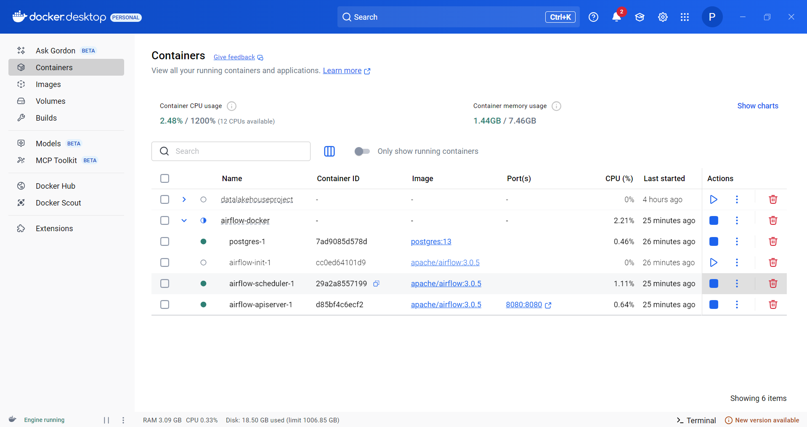
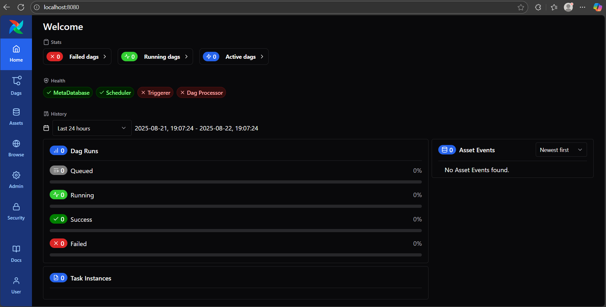

# 🚀 Airflow Lite với Docker

Apache Airflow là một công cụ **orchestration** (điều phối) giúp tự động hoá và quản lý các **data pipeline**.  
Airflow có 2 phiên bản phổ biến:

- **Airflow Full**: phiên bản đầy đủ, dùng trong môi trường production với nhiều worker, scheduler, và tích hợp mở rộng.
- **Airflow Lite**: phiên bản gọn nhẹ, phù hợp để cài đặt trên **local machine**, thích hợp cho việc học tập, thử nghiệm và chạy các workflow đơn giản.

---

## ⚙️ Thành phần chính của Airflow Lite

- **x-airflow-common**  
  Cấu hình chung được chia sẻ cho các service trong Airflow.

- **AIRFLOW__CORE__EXECUTOR = LocalExecutor**  
  Chế độ thực thi dành cho Airflow Lite (chạy trực tiếp trên local, không cần Celery/Kubernetes).

- **Volumes**  
  Airflow sử dụng 4 thư mục chính để lưu trữ:
  - `dags/` → chứa các DAG (workflow)
  - `logs/` → lưu log thực thi
  - `config/` → file cấu hình
  - `plugins/` → plugin mở rộng

- **Postgres**  
  Database metadata của Airflow (lưu trạng thái DAGs, task, logs...).

- **airflow-scheduler**  
  Quản lý và điều phối lịch chạy của các DAGs.

- **airflow-init**  
  Service khởi tạo Airflow (chạy trước lần đầu).

- **airflow-api-server**  
  (trước đây gọi là `airflow-webserver` trong các phiên bản cũ)
  Giao diện web UI của Airflow, truy cập tại [http://localhost:8080](http://localhost:8080).

---

## 📦 Cài đặt với Docker
0. Giao diện Docker Desktop:



1. Clone repository này về máy:
   ```bash
   git clone https://github.com/<your-repo>/airflow-docker-lite.git
   cd airflow-docker-lite
2. Khởi tạo airflow:
    ```bash
    docker compose up 
3. Mở UI:
    [http://localhost:8080](http://localhost:8080)
4. Đăng nhập với tài khoản mặc định:
- **Username**: airflow
- **Password**: airflow

## 📸 Giao diện Airflow

Sau khi đăng nhập thành công, bạn sẽ thấy giao diện chính của Airflow:




## 📌 Ghi chú

- **Airflow Lite** chỉ nên dùng cho **học tập và phát triển trên local**, **không khuyến nghị** triển khai trong môi trường production.  
- Trước khi chạy `docker compose up`, cần tạo file `.env` với nội dung:  
  ```bash
  AIRFLOW_UID=501
  AIRFLOW_GID=0

## 🎯 Mục tiêu 
- Viết 1 **DAG cơ bản** để chạy demo **data pipeline** với Airflow Lite.  
- DAG này có thể bao gồm các bước đơn giản như:  
  - Tạo file CSV mẫu  
  - Đọc dữ liệu từ CSV  
  - In ra log hoặc lưu vào database (MySQL/Postgres)  
- Mục tiêu là giúp làm quen với cách viết DAG, cấu trúc task, và cách theo dõi trên Airflow UI.  

